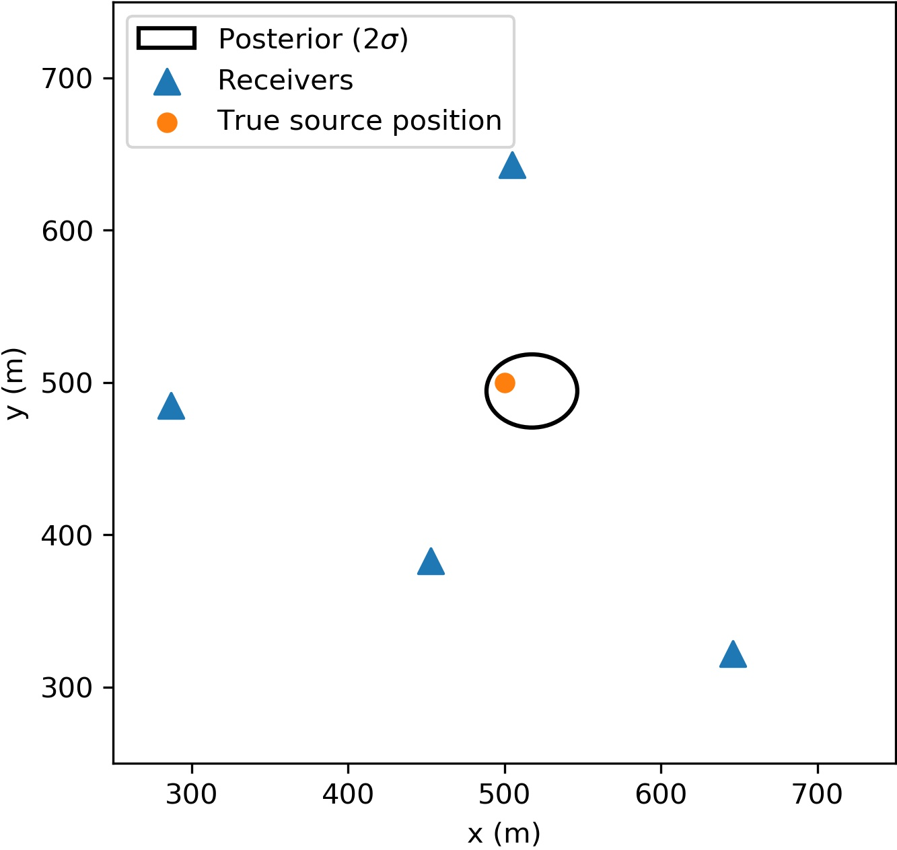

# Bayesian time-difference-of-arrival positioning using pymc3

This code carries out Bayesian time-difference-of-arrival positioning using pymc3 (https://docs.pymc.io/).

See my blog post here: https://benmoseley.blog/my-research/bayesian-positioning-with-pymc3/

### Task

**Multilateration** is a classic positioning problem where given the arrival times at a set of receivers from a source of energy waves propagating outwards one tries to infer the location of the source.

<!---include "" for proper github rendering-->

The simplest way to solve this problem is to draw the locus of possible source locations for each receiver and search for where they overlap. However, when the time of arrival measurements are noisy and the wave speed is uncertain, the loci will not always overlap and this method becomes ambiguous. This method also assumes we know the wave speed and the time at which the source was emitted, which are not always known. 

Hyperbolic time-difference-of-arrival (TDOA) methods are a different in that they do not need to know the source emission time, but can still **suffer from ambiguity in the presence of noise**.

### Workflow

Here we treat the problem by writing a **fully probabilistic model in pymc3** and sample over its posterior distribution to infer the source location. We define the source location, observed arrival times and wave speed as random variables and assert priors over them, allowing us to solve the multilateration problem without knowing the source emission time and the wave speed and to quantify our uncertainty.

### Installation

bayesian-time-difference-of-arrival-positioning only requires Python libraries to run. We recommend setting up an new environment, for example:
```bash
conda create -n position python=3.7  # Use Anaconda package manager
conda activate position
```
and then installing the following dependencies:
```bash
conda install scipy matplotlib jupyter
pip install pymc3
```

### Getting started

Below is an example use of `BayesianTDOAPositioner`, which is the main class.

For more help please see the [Jupyter notebook](https://github.com/benmoseley/bayesian-time-difference-of-arrival-positioning/blob/master/Bayesian%20time-difference-of-arrival%20positioning%20with%20pymc3.ipynb) or my [blog post](https://benmoseley.blog/my-research/bayesian-positioning-with-pymc3/).

```python
# generate some test data
N_STATIONS = 4
stations = np.random.randint(250,750, size=(N_STATIONS,2))# station positions (m)
x_true = np.array([500,500])# true source position (m)
v_true = 346.# speed of sound (m/s)
t1_true = 0.5*(np.sqrt(2)*500/346)# can be any constant, as long as it is within the uniform distribution prior on t1
d_true = np.linalg.norm(stations-x_true, axis=1)
t0_true = d_true/v_true# true time of flight values
t_obs = t0_true-t1_true# true time difference of arrival values
t_obs = t_obs+0.05*np.random.randn(*t_obs.shape)# noisy observations

# define a forward probabilistic model and sample the posterior
B = BayesianTDOAPositioner(# defines a pymc3 forward model
                 stations,
                 x_lim=1000,# maximum box size (m)
                 v_mu=346,# mean of velocity prior (m/s)
                 v_sd=20,# standard deviation of velocity prior (m/s)
                 t_sd=0.05)# standard deviation of observed values (s)
trace, summary, _, _ = B.sample(t_obs)
```

Estimated location of source:

<!---include "" for proper github rendering-->

Posterior samples generated by `pymc3`:

<!---include "" for proper github rendering-->
